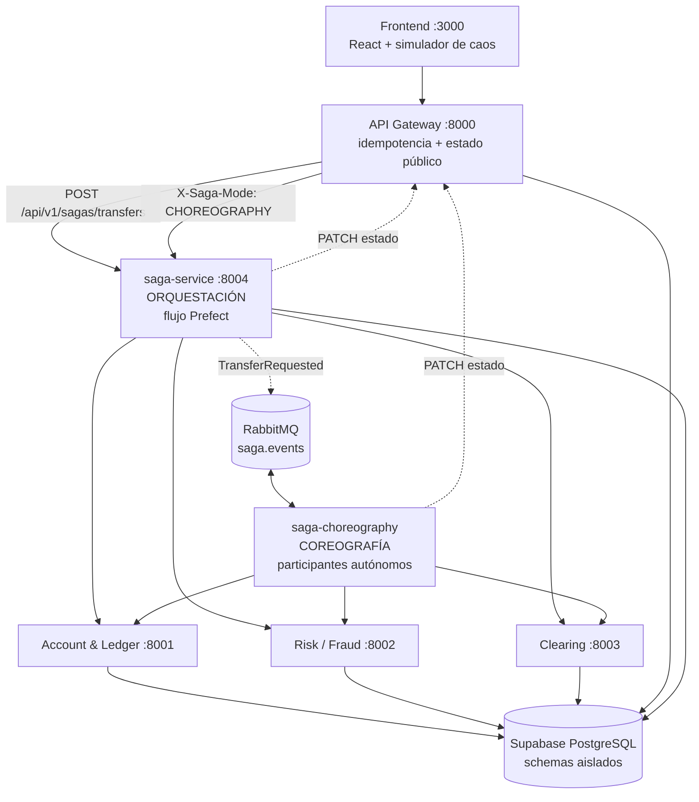

# NovaBank — Saga bancaria: coreografía vs. orquestación

Transferencias interbancarias distribuidas implementadas con el **Patrón Saga**
bajo el modelo BASE, en sus **dos modalidades**: un orquestador central
implementado como flujo de Prefect, y una versión coreografiada sobre RabbitMQ.
Persistencia en Supabase PostgreSQL con aislamiento lógico por servicio.

## Arquitectura



| Servicio | Puerto | Responsabilidad |
|---|---|---|
| `frontend` | 3000 | Interfaz de demostración, simulador de caos y visualización de la Saga |
| `api-gateway` | 8000 | Punto de entrada, `Idempotency-Key`, registro público de la transferencia |
| `account-service` | 8001 | Débitos, créditos y reversas de balance |
| `risk-service` | 8002 | Reglas antifraude y límites |
| `clearing-service` | 8003 | Liquidación interbancaria simulada, latencia y timeouts |
| `saga-service` | 8004 | Coordinador de la saga orquestada y trazabilidad |
| `saga-choreography` | — | Participantes autónomos de la saga coreografiada |
| `rabbitmq` | 5672 / 15672 | Bus de eventos de dominio |

## Puesta en marcha

### 1. Credenciales

```bash
cp .env.example .env
```

Rellena las cinco URLs de Supabase y define `SAGA_INTERNAL_TOKEN` con cualquier
valor secreto. `.env` está en `.gitignore` y nunca debe subirse.

### 2. Migraciones

Aplica en orden los archivos de `supabase/migrations/` sobre tu proyecto de
Supabase (SQL Editor o `supabase db push`). Crean los schemas `gateway`,
`account`, `risk`, `clearing` y `saga`, y siembran tres cuentas de prueba:
`ACC-001`, `ACC-002` y `ACC-003`.

### 3. Levantar todo

```bash
docker compose up --build
```

Comprueba que los cinco servicios respondan:

```bash
for p in 8000 8001 8002 8003 8004; do curl -s localhost:$p/health; echo; done
```

Interfaces disponibles:

- **Aplicación: `http://localhost:3000`**
- Documentación interactiva de cada servicio: `http://localhost:<puerto>/docs`
- Consola de RabbitMQ: `http://localhost:15672` (`guest` / `guest`)

## La interfaz

Todo lo que muestra la interfaz sale de datos reales; no hay pasos simulados ni
marcas de tiempo reconstruidas.

| Zona | De dónde salen los datos |
|---|---|
| Saldos del formulario | `GET /accounts/{id}` en vivo, para evidenciar que una transferencia compensada no mueve un peso |
| Progreso de la Saga | Filas reales de `saga.saga_steps`, con su estado y su duración |
| Bitácora de auditoría | Event store `saga.saga_events` en coreografía; bitácora de pasos en orquestación |
| Trazabilidad | `saga.saga_steps` ordenada por `sequence`, con la caja **Orden de reversa** |
| Modalidad | Selector Orquestación / Coreografía, que viaja como header `X-Saga-Mode` |

El selector de modalidad permite demostrar los dos enfoques en la misma sesión,
con la misma transferencia y los mismos switches de caos.

### Desarrollo del frontend

```bash
cd frontend && npm install && npm run dev
```

Vite levanta en `http://localhost:5173` y hace de proxy hacia los servicios
locales. Necesita Node 20 o superior; si no lo tienes instalado, usa la imagen
de Docker, que compila el frontend por su cuenta.

## Ejecutar una transferencia

```bash
curl -X POST http://localhost:8000/api/v1/transfers \
  -H 'Content-Type: application/json' \
  -H 'Idempotency-Key: 550e8400-e29b-41d4-a716-446655440000' \
  -d '{
        "source_account_id": "ACC-001",
        "destination_account_id": "ACC-002",
        "amount": "50000",
        "currency": "COP",
        "chaos": {"force_risk_failure": false, "force_clearing_timeout": false}
      }'
```

El Gateway responde `201` con estado `RECIBIDA` y entrega la transferencia a la
Saga. A partir de ahí el estado avanza solo:

```bash
curl http://localhost:8000/api/v1/transfers/<transfer_id>   # estado público
curl http://localhost:8004/api/v1/sagas/<transfer_id>       # traza completa
```

La traza de la saga incluye la bitácora de auditoría paso a paso y, en
coreografía, la cadena completa de eventos de dominio.

### Alternar entre las dos modalidades

Por defecto manda `SAGA_MODE` del entorno. Para cambiarlo en una petición
concreta, sin tocar el contrato JSON:

```bash
-H 'X-Saga-Mode: ORCHESTRATION'   # coordinador central (flujo Prefect)
-H 'X-Saga-Mode: CHOREOGRAPHY'    # participantes autónomos sobre RabbitMQ
```

### Simulador de caos

Los dos switches obligatorios viajan en el objeto `chaos`:

| Switch | Efecto | Caso |
|---|---|---|
| `force_risk_failure` | Riesgo rechaza tras un débito exitoso | CP-03 |
| `force_clearing_timeout` | La red interbancaria expira | CP-04 |

## Casos de prueba

| Caso | Escenario | Estado final | Compensaciones |
|---|---|---|---|
| CP-01 | Camino feliz | `CONFIRMADA` | ninguna |
| CP-02 | Fondos insuficientes | `RECHAZADA_FONDOS` | **ninguna** — el débito nunca ocurrió |
| CP-03 | Fallo de riesgo | `RECHAZADA_RIESGO` | `DEBIT` |
| CP-04 | Timeout de clearing | `RECHAZADA_RED` | `RISK` → `DEBIT`, en ese orden |
| CP-05 | Reintento con la misma clave | `CONFIRMADA` | ninguna, sin doble cobro |

Los cinco pasan en **ambas** modalidades.

**Pruebas unitarias** (39 casos, sin red ni base de datos, menos de un segundo):

```bash
cd saga-service && PYTHONPATH=. pytest -q
```

**Verificación contra el sistema en marcha**, entrando por el Gateway como lo
haría el frontend. Comprueba el estado final, las compensaciones registradas y
que los saldos queden intactos cuando la transferencia no debe prosperar:

```bash
python scripts/verificar_casos.py AMBAS
```

Pruebas de los microservicios:

```bash
cd api-gateway && PYTHONPATH=. pytest
```

## Observabilidad

- **Delays configurables.** `SAGA_STEP_DELAY_SECONDS` (por defecto `3`, rango
  recomendado 2–4) pausa antes de cada paso y de cada compensación, para que el
  avance y la marcha atrás se aprecien durante la demostración. Ponlo en `0`
  para las pruebas automatizadas.
- **Prefect.** Con `SAGA_USE_PREFECT=true` cada paso y cada compensación es una
  task con nombre propio: en CP-04 se ven `DEBIT`, `RISK`, `CLEARING`,
  `compensate-RISK` y `compensate-DEBIT`.
- **Bitácora de auditoría.** `saga.saga_steps` guarda una fila por paso con
  servicio, operación, estado, código de error y duración. Ordenar por
  `sequence` demuestra que la reversa ocurrió en orden inverso.
- **Event store.** `saga.saga_events` conserva todos los eventos de dominio en
  el formato del contrato, independientemente de RabbitMQ.
- **Logs.** Una línea por operación:
  `transfer_id=... service=... operation=... status=... error=...`

## Documentación

| Documento | Contenido |
|---|---|
| [docs/01-diseno-saga.md](docs/01-diseno-saga.md) | Máquina de estados, catálogo de eventos, decisiones de arquitectura |
| [docs/02-orquestacion-vs-coreografia.md](docs/02-orquestacion-vs-coreografia.md) | Comparativa de las dos modalidades con evidencia de las corridas |
| [contrato-integracion.txt](contrato-integracion.txt) | Contrato de integración acordado por el equipo |

## Reparto del trabajo

| Persona | Entregable |
|---|---|
| 1 | API Gateway, Account & Ledger, Risk, Clearing, modelo de datos e idempotencia |
| 2 | Saga orquestada y coreografiada, broker de eventos, compensaciones y documentación comparativa |
| 3 | Frontend, simulador de caos, visualización de estados y casos de prueba |

## Notas de operación

- **Usa el pooler de Supabase en modo transacción (puerto 6543).** El de modo
  sesión (5432) limita **todo el proyecto a 15 conexiones**, y seis procesos las
  agotan por sí solos: el síntoma es que un servicio deja de responder sin
  registrar ningún error. Por eso los pools llevan `prepare_threshold=None`, que
  es lo que exige ese modo.
- **Los saldos se gastan.** Cada corrida mueve dinero real en la base. Si CP-03
  o CP-04 empiezan a devolver `RECHAZADA_FONDOS`, la cuenta origen se quedó sin
  fondos; `scripts/verificar_casos.py` la recarga por sí solo antes de empezar.
- **Un solo worker de coreografía.** Si se levantan varios, cada cola tendrá
  varios consumidores y multiplicará las conexiones a la base. Compruébalo con
  `docker compose ps` o `rabbitmqctl list_queues name consumers`.

## Variables de entorno

| Variable | Por defecto | Para qué sirve |
|---|---|---|
| `SAGA_MODE` | `ORCHESTRATION` | Modalidad por defecto del Gateway |
| `SAGA_STEP_DELAY_SECONDS` | `3` | Pausa entre micro-pasos |
| `SAGA_USE_PREFECT` | `true` | Ejecuta el orquestador como flujo de Prefect |
| `SAGA_INTERNAL_TOKEN` | — | Protege el endpoint interno de actualización de estado |
| `SAGA_MAX_ATTEMPTS` | `3` | Reintentos ante fallos técnicos transitorios |
| `RISK_MAX_AMOUNT` | `1000000` | Límite por encima del cual Riesgo rechaza |
| `CLEARING_LATENCY_SECONDS` | `0` | Latencia simulada de la red interbancaria |
| `DB_POOL_MAX_SIZE` | `5` | Tamaño del pool de conexiones por servicio |
