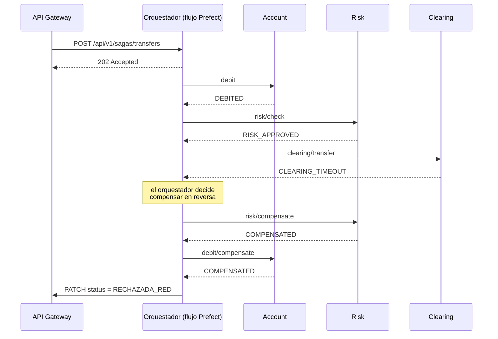
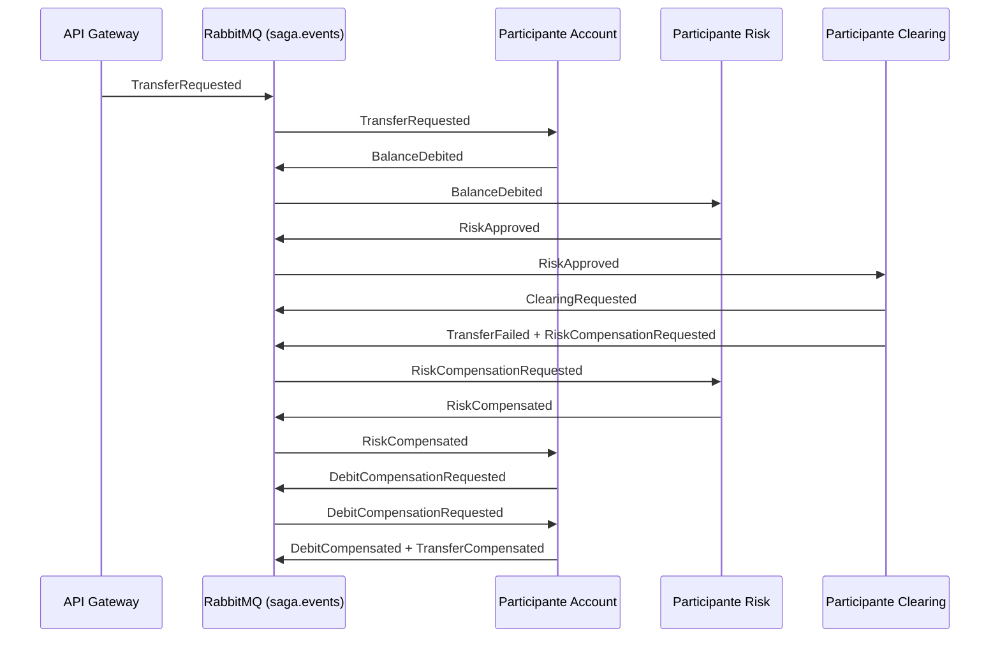

# Saga Orquestada vs. Saga Coreografiada

> Documento comparativo exigido por el enunciado (§5, Entregables). Las dos
> modalidades están implementadas sobre **los mismos cuatro pasos y los mismos
> microservicios**; lo único que cambia es quién decide el orden. Esa igualdad
> deliberada es lo que hace que la comparación signifique algo: cualquier
> diferencia observada se debe al estilo de coordinación, no al dominio.

---

## 1. El mismo problema, dos formas de resolverlo

Una transferencia son cuatro transacciones locales, cada una en un servicio con
su propia base de datos y su propia compensación:

| # | Paso | Servicio | Compensación |
|---|---|---|---|
| 1 | `DEBIT` | Account & Ledger | `debit_compensate` |
| 2 | `RISK` | Risk / Fraud | `risk_compensate` |
| 3 | `CLEARING` | Interbank Clearing | `clearing_compensate` |
| 4 | `CREDIT` | Account & Ledger | `credit_compensate` |

No hay transacción global ACID. Cada servicio confirma lo suyo de inmediato y la
Saga se encarga de que el conjunto termine consistente. La pregunta que separa
las dos modalidades es una sola: **¿quién sabe cuál es el siguiente paso?**

---

## 2. Orquestación: alguien sabe el plan completo



El plan vive en un solo lugar, [coordinator.py](../saga-service/app/orchestration/coordinator.py).
Es un bucle sobre la lista de pasos; al primer fallo sale del bucle, pregunta a
la bitácora **qué se ejecutó de verdad** y llama las compensaciones al revés:

```python
for index, step in enumerate(STEPS):
    outcome = action_runner(context, step)
    if outcome.ok:
        continue
    failure, failed_step = outcome, step
    break

executed = repository.executed_steps(transfer_id)     # fuente de verdad
for step in compensation_order(executed):             # orden inverso explícito
    compensation_runner(context, step, compensation_sequence(step))
```

Los servicios de dominio **no saben que existe una saga**: reciben llamadas HTTP
normales y responden. Todo el conocimiento del flujo está concentrado.

---

## 3. Coreografía: nadie sabe el plan, todos saben reaccionar



Aquí no existe ningún componente que conozca la secuencia. Cada participante
sólo sabe dos cosas: a qué eventos está suscrito y qué evento publica después.
La secuencia **emerge** de esas reglas locales.

### 3.1 El punto técnico central: cómo se logra el orden inverso sin coordinador

Esta es la parte donde la mayoría de implementaciones coreografiadas fallan. La
tentación es que, al fallar el clearing, se publiquen a la vez
`RiskCompensationRequested` y `DebitCompensationRequested`. Eso ejecutaría las
dos compensaciones **en paralelo**, y la rúbrica lo penaliza explícitamente
("carece de control estricto de reversa").

La solución aquí es **encadenar por causalidad**: cada compensación confirmada
es lo que dispara la siguiente.

```
Clearing falla
      │
      └─► RiskCompensationRequested
                │
                └─► (Risk compensa) ──► RiskCompensated
                                             │
                                             └─► DebitCompensationRequested
                                                       │
                                                       └─► (Account compensa) ──► DebitCompensated
```

En el código, el participante de Account está suscrito a `RiskCompensated` y es
esa suscripción —y no un coordinador— la que garantiza que el débito se revierta
**después** del riesgo:

```python
if event.event_type in {EventType.RISK_REJECTED, EventType.RISK_COMPENSATED}:
    participant.emit(EventType.DEBIT_COMPENSATION_REQUESTED, request, ...)
```

---

## 4. Diferencias observadas

| Dimensión | Orquestación | Coreografía |
|---|---|---|
| **Quién conoce el flujo** | Un solo componente | Nadie; está repartido en las suscripciones |
| **Acoplamiento** | El orquestador depende de los 4 servicios. Los servicios no dependen de nadie. | Ningún participante conoce a otro; todos dependen del contrato de eventos. |
| **Dónde se lee el flujo** | En un archivo, de arriba abajo | Reconstruyéndolo desde la tabla de bindings |
| **Orden inverso** | Explícito: `compensation_order(executed)` | Emergente: cada `*Compensated` dispara el siguiente |
| **Agregar un paso** | Una entrada en `STEPS` | Un participante nuevo + rebinding de dos colas |
| **Punto único de fallo** | Sí: si cae el orquestador, la saga se detiene | No: los eventos quedan en cola y se procesan al reconectar |
| **Depurar un fallo** | Leer un stack trace | Reconstruir la cadena desde `saga.saga_events` |
| **Observabilidad nativa** | Flujo y tasks de Prefect | Consola de RabbitMQ + event store |
| **Latencia** | Secuencial y predecible | Igual aquí, porque la cadena es causal |
| **Riesgo característico** | El orquestador se vuelve un monolito de lógica | Dependencias circulares y cadenas difíciles de seguir |

### 4.1 Evidencia de las corridas reales

Misma transferencia, mismo fallo forzado (`force_clearing_timeout`), dos
modalidades. Ambas dejan los saldos idénticos a los iniciales.

**Orquestación** — bitácora `saga.saga_steps`:

```
→ [  1] DEBIT     debit                EXECUTED
→ [  2] RISK      risk_check           EXECUTED
→ [  3] CLEARING  clearing_transfer    FAILED        CLEARING_TIMEOUT
→ [  4] CREDIT    credit               SKIPPED
↩ [103] RISK      risk_compensate      COMPENSATED
↩ [104] DEBIT     debit_compensate     COMPENSATED
```

**Coreografía** — misma bitácora, más la cadena de eventos:

```
→ [  1] DEBIT     debit                EXECUTED
→ [  2] RISK      risk_check           EXECUTED
→ [  3] CLEARING  clearing_transfer    FAILED        CLEARING_TIMEOUT
↩ [103] RISK      risk_compensate      COMPENSATED
↩ [104] DEBIT     debit_compensate     COMPENSATED

TransferRequested → BalanceDebited → RiskApproved → ClearingRequested
  → TransferFailed → RiskCompensationRequested → RiskCompensated
  → DebitCompensationRequested → DebitCompensated → TransferCompensated
```

Dos diferencias visibles y explicables:

1. La orquestación registra `CREDIT` como `SKIPPED`. **Sabía** que ese paso
   existía y decidió no ejecutarlo. La coreografía no tiene la noción de un paso
   omitido: simplemente nadie publicó el evento que lo habría disparado.
2. La coreografía produce diez eventos donde la orquestación produce seis filas.
   Ese coste extra es exactamente el precio del desacoplamiento.

---

## 5. Consistencia eventual (BASE) en ambas

Ninguna de las dos usa un commit global. Las dos atraviesan estados intermedios
reales y observables:

- **Basically Available** — cada servicio confirma su transacción local sin
  esperar a los demás; ninguno bloquea al otro.
- **Soft state** — entre `DEBITED` y `COMPENSATED` el dinero está temporalmente
  fuera de la cuenta origen y en ningún lado. Es un estado inconsistente
  *visible y esperado*, no un error.
- **Eventual consistency** — toda ejecución termina en un estado terminal, y la
  prueba dura es que en CP-02, CP-03 y CP-04 los saldos vuelven exactamente a su
  valor inicial.

Esto es lo que 2PC habría resuelto con bloqueos globales, al precio de que un
servicio lento congelara a todos los demás.

---

## 6. Idempotencia: tres barreras superpuestas

Es lo que permite reintentar sin miedo, y es lo que hace pasar CP-05.

| Barrera | Dónde | Qué evita |
|---|---|---|
| 1. `Idempotency-Key` | API Gateway | Que un doble clic cree dos transferencias |
| 2. `saga.processed_events` | Participantes | Que una reentrega de RabbitMQ actúe dos veces |
| 3. `transfer_id` por operación | Cada microservicio | Que un reintento mueva el saldo dos veces |

La orquestación usa las barreras 1 y 3; la coreografía usa las tres, porque
`at-least-once` es inherente a un broker. Sin la barrera 2, la coreografía
tendría un riesgo de doble cobro que la orquestación no tiene — otra diferencia
real entre los dos enfoques.

---

## 7. Cuál usar

**Orquestación** cuando el flujo es un proceso de negocio con un dueño claro,
cuando hay que auditarlo o explicárselo a alguien no técnico, y cuando el orden
de las compensaciones es un requisito duro. Es el caso de una transferencia
bancaria: alguien tiene que poder responder "¿por qué se revirtió y en qué
orden?" mirando un solo sitio.

**Coreografía** cuando los servicios pertenecen a equipos distintos que no deben
coordinarse para desplegar, cuando hace falta agregar reacciones nuevas sin
tocar lo existente (notificaciones, antifraude, analítica), y cuando ningún
componente puede ser un punto único de fallo.

En producción no son excluyentes: lo habitual es orquestar el núcleo
transaccional y coreografiar lo que cuelga de él.

---

## 8. Cómo verificar cada afirmación de este documento

```bash
# Los cinco casos en las dos modalidades, sin red ni base de datos
cd saga-service && PYTHONPATH=. pytest -q

# Contra los servicios reales, alternando la modalidad por header
curl -X POST http://localhost:8000/api/v1/transfers \
  -H 'Content-Type: application/json' -H 'X-Saga-Mode: CHOREOGRAPHY' \
  -d '{"source_account_id":"ACC-001","destination_account_id":"ACC-002",
       "amount":"50000","chaos":{"force_clearing_timeout":true}}'

# La traza completa: pasos, compensaciones y cadena de eventos
curl http://localhost:8004/api/v1/sagas/<transfer_id>
```
